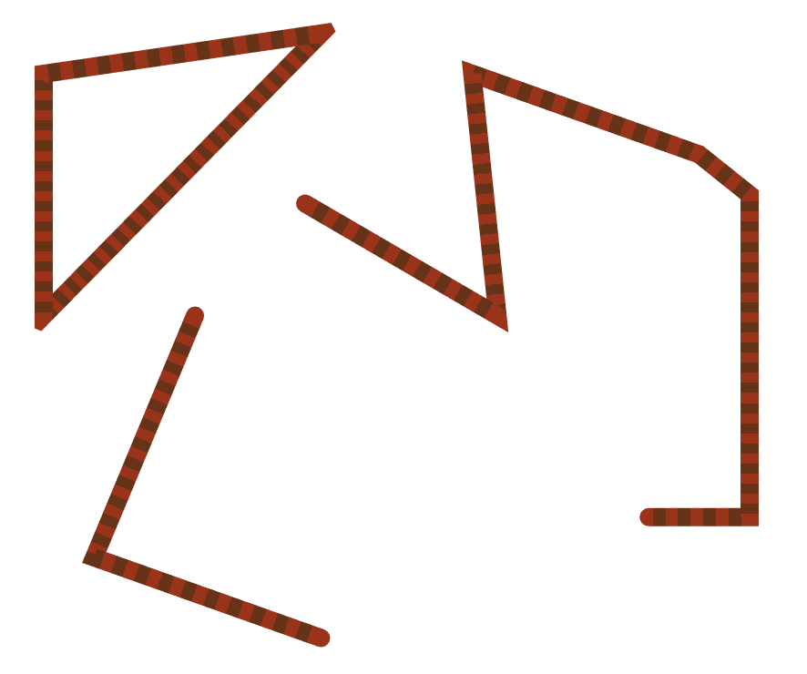

# (WIP) Instanced Lines for REGL

## Highly extendable instanced line rendering in a single draw call.
Based on [Regl](https://github.com/regl-project/regl).

Loosely based on Rye Terrell's [Instanced Line Rendering](https://wwwtyro.net/2019/11/18/instanced-lines.html), but it is a very good introduction.

Features:
- batch rendering of lines
- vertex shader expanded
- variable width (in each point)
- separate caps (`butt`, `square`, `round`) and
- joins (`bevel`, `miter(limit)`, `miterSquare`, `round`)
- GLSL injectable to tailor to your needs (e.g. do you have a non-linear camera?)



There are two ways to use this library:
- use the high level wrapper
- extend the lower level base

## High level API

Example usage:
```typescript
import createRegl from 'regl';
import { createLine3D, CapType, JoinType } from 'regl-insta-lines';

const regl = createRegl();

// create lines
const lines = createLines3D(regl, {
  cap: CapType.square,
  join: JoinType.miter(2),  // specify limit here
  joinCount: 3,
  cameraTransform: glsl`
    // optional
    vec4 cameraTransform(vec4 pos) {
      return ... your cool non-linear camera
    }
  `,
  ... other props
});

// describe lines
lines.setLines([{
  points: ...,
  widths: ...,
  closed: true
}, {
  ...
}]);

// you can also set constant widths for all lines
// a little faster (probably)
lines.setWidth(50)  // in pixels

// render them
regl.frame(()=>{
  lines.render();
})
```

| Property | Type | Default | Description |
|----------|------|---------|-------------|
| width | `number` | `1.0` | Constant width of all lines |
| distanceFn | `(a: vec3, b: vec3) => number` | `vec3.distance` | Function that calculates distance between two points (used to determine `distanceAlongPath` varying for fragment shader, useful for dashes for example) |
| frag | `string` (GLSL) | fill white | Fragment shader now gets an additional varying in addition to base: `vec2 distanceAlongPath;` where `x=total distance, y=relative distance` |
| cameraTransform | `string` (GLSL) | identity | GLSL code for a function of the following definition: `vec4 cameraTransform(vec4 pos);` |

Plus, any `base` API properties.

## Base API

Very much WIP

| Property | Type | Default | Description |
|----------|------|---------|-------------|
| cap | `string` (GLSL) | `CapType.butt` | Any of `CapType`s or your own custom GLSL function. Supported: `butt`, `square`, `round` |
| join | `string` (GLSL) | `JoinType.bevel` | Any of `JoinType`s or your own custom GLSL function. Supported: `bevel`, `miter`, `round`, `miterSquare` |
| joinCount | `int` | `1` | Number of triangles approximating the joins. NOTE: joins (like miter or round) become bevel joins when set to 1, so make sure to set this to something larger if using those joins / caps. |
| frag | `string` (GLSL) | fill white | Coloring method, gets the following varying: `vec2 vUv;` uv coordinate of the segment. |
| primitive | regl's primitive type | `triangles` | Used for debug when rendering with `lines` for example |
| declarationsGLSL | `string` (GLSL) | identity | GLSL declarations code. At least `vec4 cameraTransform(vec4 pos);`. Useful for custom attributes. |
| defineVerticesGLSL | `string` (GLSL) | `undefined` | Non-optional when using just the base. Must define at least `vec3 p0, p1, p2, p3; float r0, r1, r2, r3;` |
| postprocessVerticesGLSL | `string` (GLSL) | `undefined` | Optional GLSL code that modifies clip or screen-space coordinates. |

## Future Improvements
- Fix a bug when using round joins + variable width
- Correctly tesselate joins when possible (right now segments just overlap always)
- provide a few default fragment shaders (e.g. dashes)
