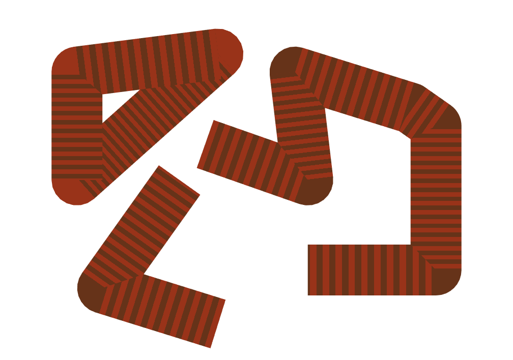
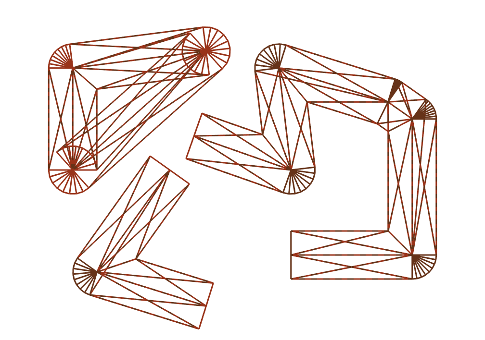
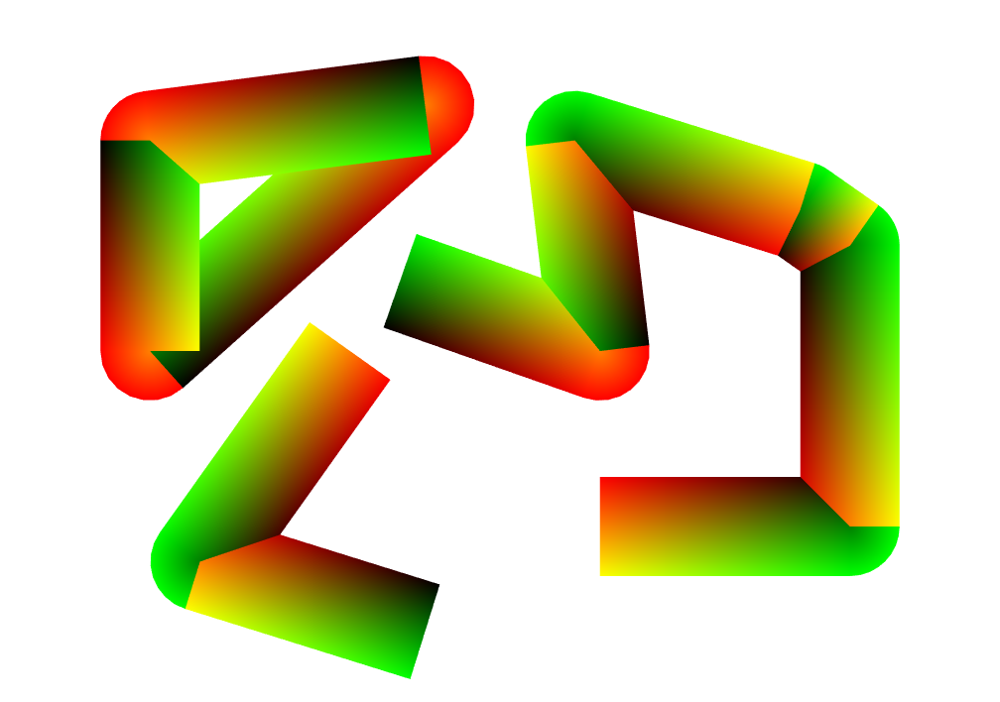
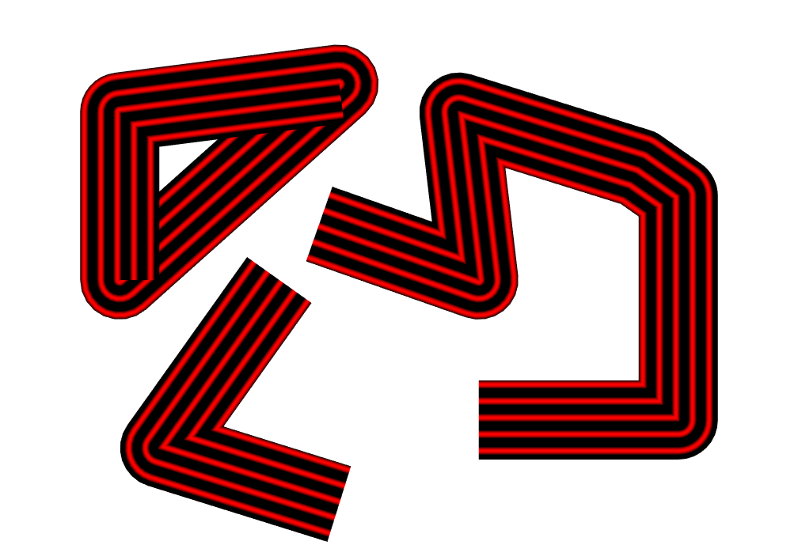
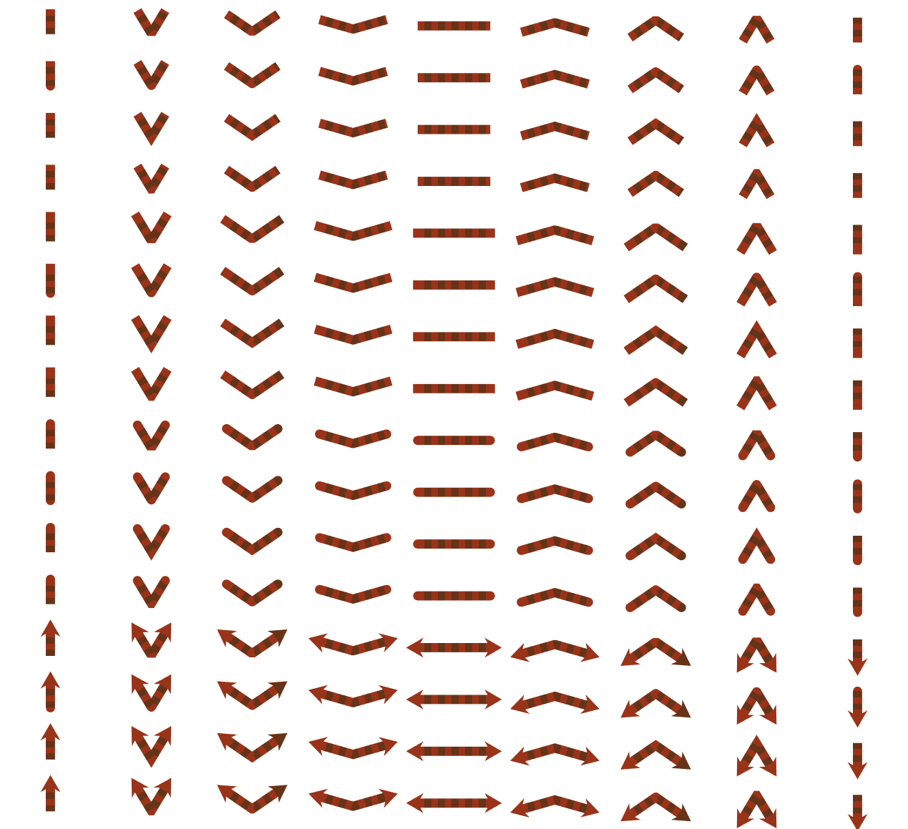
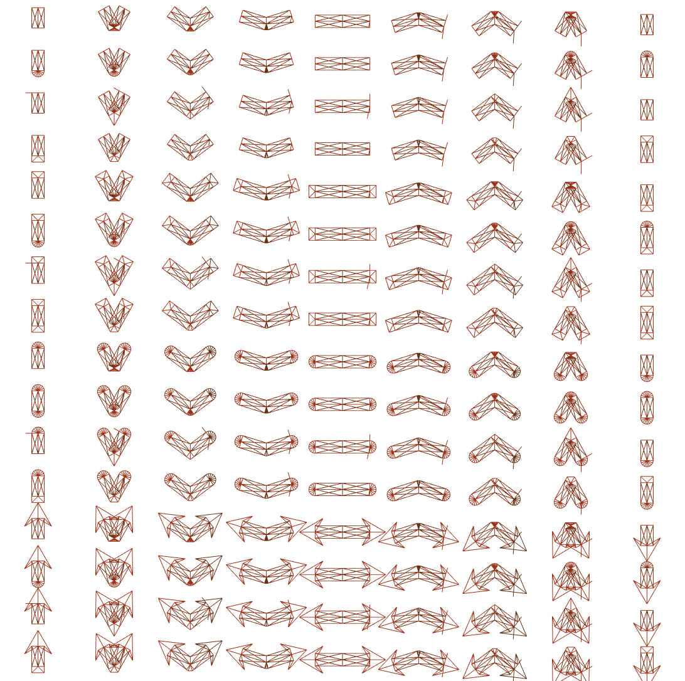
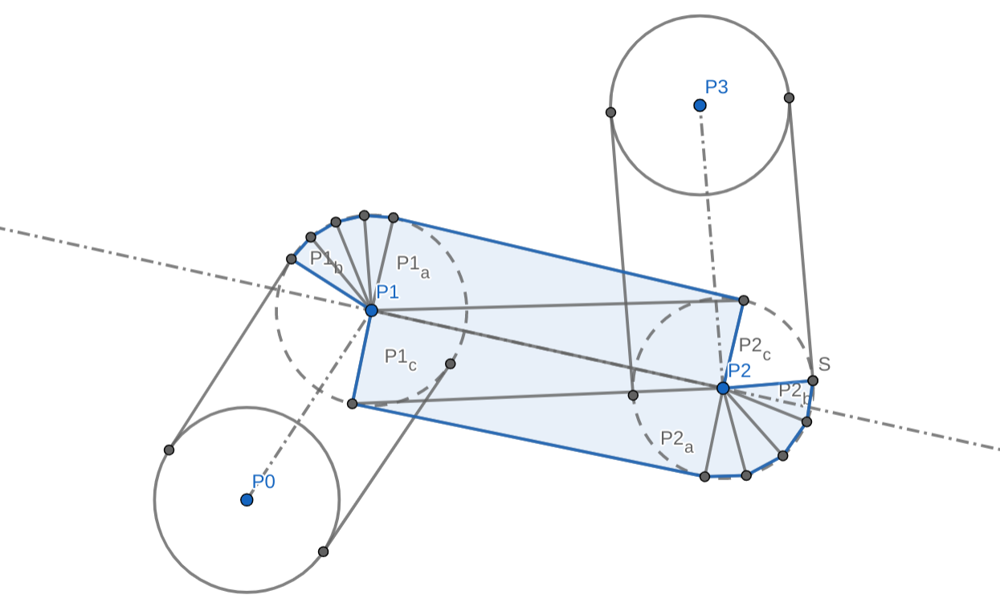

# (WIP) Instanced Lines for REGL

## Highly extendable instanced line rendering in a single draw call.
Based on [Regl](https://github.com/regl-project/regl).

Loosely based on Rye Terrell's [Instanced Line Rendering](https://wwwtyro.net/2019/11/18/instanced-lines.html), highly recommended as introduction.

## Installation
```bash
npm install --save regl-insta-lines
# or
yarn add regl-insta-lines
```

## Features:
- batch rendering of lines
- vertex shader expanded
- start / end caps (`butt`, `square`, `round`, `arrow(size, angle)`)
- joins (`bevel`, `miter(limit)`, `miterSquare`, `round`)
- GLSL injectable to tailor to your needs (e.g. do you have a non-linear camera?)
- full type support

| filled | wireframe |
|-|-|
|  |  |

| UVs | Decoration using UV.y |
|-|-|
|  |  |

There are two ways to use this library:
- extend the lower level base
- use the high level wrapper

## High level API

Example usage:
```typescript
import createRegl from 'regl';
import { createLine3D, CapType, JoinType } from 'regl-insta-lines';

const regl = createRegl();

// create lines
const lines = createLines3D(regl, {
  width: 60,  // in pixels
  cap: CapType.square,
  join: JoinType.miter(2),  // specify limit here
  joinCount: 3,
  cameraTransform: glsl`
    // optional
    vec4 cameraTransform(vec4 pos) {
      return ... your cool non-linear camera
    }
  `,
  ... other props
});

// describe lines
lines.setLines([{
  points: ...,
  closed: true
}, {
  ...
}]);


// render them
regl.frame(()=>{
  // set width each frame
  lines.setWidth(30 * Math.sin(ctx.time))  // in pixels
  lines.render();
})
```

| Property | Type | Default | Description |
|----------|------|---------|-------------|
| distanceFn | `(a: vec3, b: vec3) => number` | `vec3.distance` | Function that calculates distance between two points (used to determine `distanceAlongPath` varying for fragment shader, useful for dashes for example) |
| frag | `string` (GLSL) | fill white | Fragment shader now gets an additional varying in addition to base: `vec2 distanceAlongPath;` where `x=total distance, y=relative distance` |
| cameraTransform | `string` (GLSL) | identity | GLSL code for a function of the following definition: `vec4 cameraTransform(vec4 pos);` |

Plus, any `base` API properties.

## Base API

Very much WIP

| Property | Type | Default | Description |
|----------|------|---------|-------------|
| width | `number` | `1.0` | Width of lines in pixels |
| cap | `string` (GLSL) or `{ start: GLSL; end: GLSL; }` | `CapType.butt` | Any of `CapType`s or your own custom GLSL function. Supported: `butt`, `square`, `round` |
| join | `string` (GLSL) | `JoinType.bevel` | Any of `JoinType`s or your own custom GLSL function. Supported: `bevel`, `miter`, `round`, `miterSquare` |
| joinCount | `int` | `3` | Number of triangles approximating the joins. NOTE: joins (like miter or round) effectively become bevel joins when set to 1. |
| reverseMiterLimit | `number` | `0.5` | How far up the segment can a reverse miter go. Anything more than `0.5` runs a risk of failure, but allows sharper angles to still be reverse mitered. |
| frag | `string` (GLSL) | fill white | Fragment shader, gets the following varying: `vec2 vUv;` uv coordinate of the segment. |
| primitive | regl's primitive type | `triangles` | Used for debug when rendering with `lines` for example |
| declarationsGLSL | `string` (GLSL) | identity | GLSL declarations code. At least `vec4 cameraTransform(vec4 pos);`. Useful for custom attributes. |
| defineVerticesGLSL | `string` (GLSL) | `undefined` | Non-optional when using just the base. Must define at least `vec3 p0, p1, p2, p3;` |
| postprocessVerticesGLSL | `string` (GLSL) | `undefined` | Optional GLSL code that modifies clip or screen-space coordinates. |
| mainEndGLSL | `string` (GLSL) | `undefined` | Optional GLSL code that runs at the end of main body. |

## Future Improvements
- provide a few default fragment shaders (e.g. dashes)

## Combination Test




NOTE: "extra" lines are simply an artifact of rendering with `'line strip'`. In reality each segment is represented as 4 triangles + 2 join accordions, one on each side. Even though each segment renders an accordion on both sides, only one is visible per join because the other one gets back-face culled.

## Anatomy of a single segment

You can view this at [Geogebra](https://www.geogebra.org/geometry/uw5kurzg)


